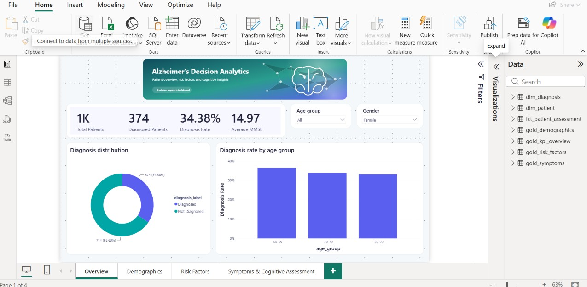
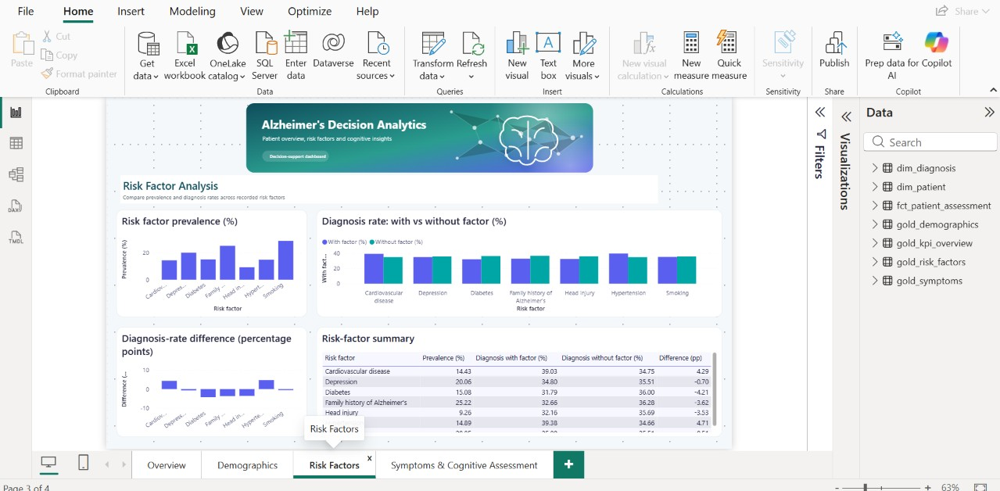

# Alzheimer's Disease Decision Analytics

An end-to-end data analytics solution that transforms a synthetic Alzheimer's disease dataset into validated, structured and decision-ready information.

The project integrates **Python, DuckDB, dbt, Apache Airflow, Docker and Power BI** to automate data ingestion, quality validation, transformation, analytical modelling and interactive visualisation.

---

## 1. Project Overview

This project analyses a synthetic Alzheimer's disease dataset containing demographic, lifestyle, medical-history, cognitive, functional and symptom-related information.

It is designed for data analysts and decision-support users who need a structured way to explore patterns in the dataset instead of working directly with a raw CSV file.

The main objective is to build a reproducible analytical pipeline that converts raw data into validated analytical models and interactive Power BI dashboards.

The project covers the complete data lifecycle:

```text
Source CSV
    |
    v
Bronze
    |
    v
Data Quality
    |
    v
Silver
    |
    v
DuckDB
    |
    v
dbt
    |
    v
Gold Models
    |
    v
Power BI
```

Apache Airflow orchestrates the complete workflow.

---

## 2. Problem Statement

Raw datasets are not directly suitable for reliable decision analysis.

Before information can be used in a dashboard, the data must be:

- validated;
- cleaned;
- transformed;
- documented;
- structured into analytical models;
- tested for consistency;
- prepared for visualisation.

Without a reproducible pipeline, analytical results may depend on manual transformations, duplicated processing steps or inconsistent calculations.

This project solves that problem by implementing an automated architecture that transforms the original dataset into reusable analytical layers and exposes the main indicators through Power BI.

---

## 3. Dataset

The project uses the **Alzheimer's Disease Dataset** available on Kaggle:

https://www.kaggle.com/datasets/rabieelkharoua/alzheimers-disease-dataset

Source file:

```text
alzheimers_disease_data.csv
```

The dataset contains:

- 2,149 records;
- 35 source variables;
- demographic characteristics;
- lifestyle information;
- medical-history indicators;
- blood-pressure measurements;
- cholesterol measurements;
- cognitive and functional assessments;
- symptom indicators;
- diagnosis status.

The dataset is **synthetic**.

The source CSV is intentionally not stored in this GitHub repository. It must be downloaded separately and placed under:

```text
data/source/alzheimers_disease_data.csv
```

### Important Data Disclaimer

This project is intended for data analytics and decision-support training.

The dataset does not represent real patients.

Results must therefore not be interpreted as:

- epidemiological estimates;
- causal relationships;
- clinical predictions;
- medical recommendations;
- patient-level diagnostic decisions.

---

## 4. Main Features

The solution can:

- **Ingest** the original CSV into an immutable Bronze layer while generating ingestion metadata and a SHA-256 checksum.
- **Validate** data quality through schema, missing-value, duplicate, identifier, domain, range and constant-column checks.
- **Transform** validated Bronze data into an enriched Silver dataset with readable labels, analytical groups, counts and lineage information.
- **Load and model** analytical data in DuckDB using dbt staging, dimensional, fact and Gold models.
- **Export and visualise** decision-support datasets through a four-page Power BI dashboard.
- **Orchestrate** the complete pipeline automatically with Apache Airflow and Docker.

---

## 5. Architecture

The project follows a layered analytical architecture.

```text
                    +-------------------------+
                    |   Kaggle Source CSV     |
                    +------------+------------+
                                 |
                                 v
                    +-------------------------+
                    |      Bronze Layer       |
                    |  Immutable raw copy     |
                    +------------+------------+
                                 |
                                 v
                    +-------------------------+
                    |   Data Quality Checks   |
                    | Schema / Nulls / IDs    |
                    | Domains / Ranges        |
                    +------------+------------+
                                 |
                                 v
                    +-------------------------+
                    |      Silver Layer       |
                    | Cleaned + Enriched      |
                    +------------+------------+
                                 |
                                 v
                    +-------------------------+
                    |        DuckDB           |
                    | Analytical Warehouse    |
                    +------------+------------+
                                 |
                                 v
                    +-------------------------+
                    |          dbt            |
                    | Staging / Dim / Fact    |
                    +------------+------------+
                                 |
                                 v
                    +-------------------------+
                    |      Gold Models        |
                    | Decision KPIs           |
                    +------------+------------+
                                 |
                                 v
                    +-------------------------+
                    |        Power BI         |
                    | Interactive Dashboard   |
                    +-------------------------+

             Apache Airflow orchestrates the pipeline
```

Detailed architecture documentation is available in:

[`docs/architecture.md`](docs/architecture.md)

---

## 6. Data Processing Layers

### Source

The original downloaded CSV is stored locally under:

```text
data/source/
```

It is not modified by the pipeline.

### Bronze

The Bronze layer preserves the original data structure and provides a stable raw input for subsequent processing.

Generated files are stored under:

```text
data/bronze/
```

### Data Quality

Automated checks validate:

- schema consistency;
- expected columns;
- missing values;
- duplicate rows;
- duplicate patient identifiers;
- null patient identifiers;
- binary domains;
- categorical domains;
- numeric ranges;
- constant fields.

Quality reports are generated under:

```text
reports/quality/
```

### Silver

The Silver layer contains cleaned and enriched patient-level analytical data.

Transformations include:

- removal of the constant `DoctorInCharge` field;
- readable categorical labels;
- age groups;
- medical-history counts;
- symptom counts;
- MMSE bands;
- Functional Assessment bands;
- ADL bands;
- processing lineage fields.

Generated Silver files are stored under:

```text
data/silver/
```

### Warehouse

The Silver dataset is loaded into a local DuckDB analytical warehouse.

Generated database files are stored under:

```text
data/warehouse/
```

### Gold

dbt generates analytical models designed for decision analysis and Power BI.

The main Gold models are:

- `gold_kpi_overview`;
- `gold_demographics`;
- `gold_risk_factors`;
- `gold_symptoms`.

Power BI-ready exports are generated under:

```text
data/gold/powerbi/
```

---

## 7. Analytical Data Model

The dbt project implements three main analytical levels.

### Staging

```text
stg_alzheimer_patients
```

Standardises the Silver source data for downstream modelling.

### Dimensional Model

```text
dim_patient
dim_diagnosis
fct_patient_assessment
```

These models separate patient characteristics, diagnosis information and analytical assessments.

### Gold Models

```text
gold_kpi_overview
gold_demographics
gold_risk_factors
gold_symptoms
```

These models provide pre-aggregated indicators for Power BI.

---

## 8. Main KPIs

The analytical layer supports indicators such as:

| KPI | Description |
|---|---|
| Total Patients | Number of unique analytical records |
| Diagnosed Patients | Records labelled as diagnosed |
| Not Diagnosed Patients | Records labelled as not diagnosed |
| Diagnosis Rate | Diagnosed records divided by total records |
| Average Age | Mean patient age |
| Average BMI | Mean BMI |
| Average MMSE | Mean MMSE score |
| Average Functional Assessment | Mean functional-assessment score |
| Average ADL | Mean ADL score |
| Average Symptom Count | Mean number of indicated symptoms |
| Average Medical History Count | Mean number of indicated medical-history conditions |
| Factor Prevalence | Percentage of records containing a selected risk factor |
| Symptom Prevalence | Percentage of records containing a selected symptom |
| Diagnosis Rate Difference | Difference in diagnosis proportions between comparison groups |

Detailed KPI definitions are available in:

[`docs/kpi_dictionary.md`](docs/kpi_dictionary.md)

---

## 9. Power BI Dashboard

The Power BI project is stored in:

```text
dashboard/alzheimers_dashboard.pbip
```

The dashboard contains four analytical pages.

### Overview

Provides the main population and diagnosis indicators together with high-level analytical summaries.

### Demographics

Explores diagnosis patterns according to:

- age group;
- gender;
- ethnicity;
- education.

### Risk Factors

Compares selected lifestyle and medical-history indicators between analytical groups.

### Symptoms & Cognitive Assessment

Explores:

- memory complaints;
- behavioural problems;
- confusion;
- disorientation;
- personality changes;
- difficulty completing tasks;
- forgetfulness;
- MMSE;
- Functional Assessment;
- ADL.

---

## 10. Power BI Exports

Seven analytical CSV files are generated for the semantic model:

```text
dim_patient.csv
dim_diagnosis.csv
fct_patient_assessment.csv
gold_kpi_overview.csv
gold_demographics.csv
gold_risk_factors.csv
gold_symptoms.csv
```

The export logic is implemented in:

```text
src/export_powerbi.py
```

---

## 11. Airflow Orchestration

The complete workflow is orchestrated by Apache Airflow.

The DAG is defined in:

```text
dags/alzheimers_pipeline_dag.py
```

The pipeline executes seven tasks sequentially:

```text
check_source_file
        |
        v
ingest_bronze
        |
        v
validate_bronze_quality
        |
        v
transform_silver
        |
        v
load_duckdb
        |
        v
run_dbt_models
        |
        v
export_powerbi
```

This ensures that downstream transformations run only after the required upstream processing has completed.

---

## 12. Technologies Used

| Technology | Role in the project |
|---|---|
| Python 3.12 | Core data-processing and pipeline logic |
| pandas | Data ingestion, validation and transformation |
| PyArrow | Parquet support for the Silver layer |
| DuckDB | Local analytical data warehouse |
| dbt | SQL transformation, dimensional modelling, Gold models and data tests |
| Apache Airflow | Pipeline orchestration |
| PostgreSQL | Airflow metadata database |
| Redis | Celery message broker for Airflow |
| Celery | Distributed Airflow task execution |
| Docker | Containerised execution environment |
| Docker Compose | Multi-container Airflow environment |
| Power BI | Interactive analytical dashboard |
| PowerShell | Dashboard build and validation utilities |
| pytest | Automated Python unit tests |
| Git | Source version control |
| GitHub | Repository hosting and project sharing |

---

## 13. Repository Structure

```text
alzheimers-decision-analytics/
|
|-- config/
|
|-- dags/
|   `-- alzheimers_pipeline_dag.py
|
|-- dashboard/
|   |-- alzheimers_dashboard.pbip
|   |-- alzheimers_dashboard.Report/
|   |-- alzheimers_dashboard.SemanticModel/
|   |-- scripts/
|   `-- themes/
|
|-- data/
|   |-- source/
|   |-- bronze/
|   |-- silver/
|   |-- gold/
|   `-- warehouse/
|
|-- dbt_project/
|   |-- models/
|   |-- tests/
|   |-- dbt_project.yml
|   `-- profiles.yml
|
|-- docs/
|   |-- architecture.md
|   |-- data_dictionary.md
|   `-- kpi_dictionary.md
|
|-- logs/
|
|-- reports/
|   `-- quality/
|
|-- src/
|   |-- config.py
|   |-- ingest.py
|   |-- quality_checks.py
|   |-- transform.py
|   |-- load_duckdb.py
|   `-- export_powerbi.py
|
|-- tests/
|   |-- test_quality_checks.py
|   `-- test_transform.py
|
|-- .dockerignore
|-- .gitignore
|-- Dockerfile
|-- docker-compose.yaml
|-- pytest.ini
|-- requirements.txt
`-- README.md
```

---

## 14. Installation

### Prerequisites

Install the following tools before running the complete project:

- Git
- Python 3.12
- Docker Desktop
- Docker Compose
- Power BI Desktop
- Node.js and npm/npx for optional PBIR structural validation

---

### Clone the Repository

```bash
git clone https://github.com/ChaimaAZZOUHRI/alzheimers-decision-analytics.git
```

Open the project directory:

```bash
cd alzheimers-decision-analytics
```

---

### Create a Python Virtual Environment

On Windows PowerShell:

```powershell
python -m venv .venv
```

Activate it:

```powershell
.venv\Scripts\Activate.ps1
```

---

### Install Python Dependencies

```bash
pip install -r requirements.txt
```

---

## 15. Add the Dataset

Download the Alzheimer's Disease Dataset from Kaggle:

https://www.kaggle.com/datasets/rabieelkharoua/alzheimers-disease-dataset

Place the downloaded CSV at:

```text
data/source/alzheimers_disease_data.csv
```

The source file is intentionally excluded from Git version control.

---

## 16. Run the Pipeline Locally

### Step 1 - Bronze Ingestion

```bash
python -m src.ingest
```

### Step 2 - Data Quality Validation

```bash
python -m src.quality_checks
```

### Step 3 - Silver Transformation

```bash
python -m src.transform
```

### Step 4 - Load DuckDB

```bash
python -m src.load_duckdb
```

### Step 5 - Run dbt

```bash
dbt build --no-partial-parse --project-dir dbt_project --profiles-dir dbt_project
```

### Step 6 - Generate Power BI Exports

```bash
python -m src.export_powerbi
```

After successful execution, the analytical exports are available under:

```text
data/gold/powerbi/
```

---

## 17. Run Automated Tests

Run the Python unit tests:

```bash
pytest -q
```

Current validated result:

```text
17 passed
```

Run the dbt analytical build and tests:

```bash
dbt build --no-partial-parse --project-dir dbt_project --profiles-dir dbt_project
```

Current validated result:

```text
PASS=54 WARN=0 ERROR=0
```

---

## 18. Run with Apache Airflow

The Docker Compose environment uses Apache Airflow with PostgreSQL, Redis and Celery.

Create a local `.env` file before starting Airflow.

Example:

```env
AIRFLOW_UID=50000
AIRFLOW_PROJ_DIR=.
FERNET_KEY=<YOUR_VALID_FERNET_KEY>
AIRFLOW__API_AUTH__JWT_SECRET=<YOUR_RANDOM_SECRET>
_AIRFLOW_WWW_USER_USERNAME=airflow
_AIRFLOW_WWW_USER_PASSWORD=airflow
```

Never commit the real `.env` file.

Initialise Airflow:

```bash
docker compose up airflow-init
```

Start the environment:

```bash
docker compose up -d
```

Check the containers:

```bash
docker compose ps
```

Open Airflow in a browser:

```text
http://localhost:8080
```

Then enable and run:

```text
alzheimers_decision_analytics_pipeline
```

To stop the environment:

```bash
docker compose down
```

---

## 19. Open the Power BI Dashboard

After generating the Power BI CSV exports, open:

```text
dashboard/alzheimers_dashboard.pbip
```

with Power BI Desktop.

The PBIP project includes:

- report definitions;
- semantic-model definitions;
- DAX measures;
- page definitions;
- custom themes;
- analytical visualisations.

Machine-specific Power BI cache and local-settings files are excluded from Git.

---

## 20. Power BI Validation

The repository includes an automated validation script:

```powershell
powershell -ExecutionPolicy Bypass -File dashboard\scripts\validate_powerbi_project.ps1
```

The validation checks:

- PBIP project availability;
- expected report pages;
- semantic-model tables;
- Power BI CSV exports;
- PBIR structural consistency.

The latest validation completed with:

```text
PBIR errors: 0
```

An online JSON Schema connectivity warning may appear if the Microsoft schema endpoint cannot be reached. This does not represent a PBIR structural error when the reported `errorCount` is zero.

---

## 21. Dashboard Screenshots

### Overview Dashboard



The Overview page presents the main patient, diagnosis and cognitive-assessment indicators.

### Risk Factors Dashboard



The Risk Factors page compares the presence of selected factors with diagnosis patterns in the synthetic dataset.

> The screenshot files are stored under `docs/screenshots/`.

---

## 22. My Contribution

My contribution covers the complete analytical workflow from raw data ingestion to dashboard delivery.

I worked on:

- designing the project architecture;
- implementing Bronze ingestion and metadata generation;
- developing automated data-quality checks;
- building the Silver transformation layer;
- creating derived analytical variables;
- loading the DuckDB analytical warehouse;
- developing dbt staging, dimensional, fact and Gold models;
- implementing dbt data tests;
- preparing Power BI analytical exports;
- building the Power BI semantic model and dashboard pages;
- implementing the Airflow DAG;
- integrating the pipeline with Docker;
- developing Python unit tests;
- validating the Power BI PBIP structure;
- organising and documenting the GitHub repository.

---

## 23. Difficulties Encountered

### dbt Execution inside Airflow

One difficulty occurred when dbt attempted to reuse a partial-parse cache inside the Airflow environment.

This produced an execution error linked to stale dbt macro metadata.

I investigated the dbt execution logs and reproduced the build without partial parsing.

The pipeline was stabilised by executing dbt with:

```bash
dbt build --no-partial-parse
```

This experience highlighted the importance of controlling generated build artifacts and caches in containerised analytical environments.

### Power BI Project Reproducibility

The Power BI PBIP project generated machine-specific cache, local settings and temporary files that should not be stored in Git.

I separated reproducible project definitions from local runtime artifacts, updated `.gitignore`, removed temporary files and added a Power BI validation script.

This improved the portability and cleanliness of the repository.

---

## 24. Documentation

Additional project documentation is available under `docs/`.

### Architecture

[`docs/architecture.md`](docs/architecture.md)

Describes the complete Source-to-Power-BI architecture.

### Data Dictionary

[`docs/data_dictionary.md`](docs/data_dictionary.md)

Documents the source variables, accepted domains, derived variables and Silver transformations.

### KPI Dictionary

[`docs/kpi_dictionary.md`](docs/kpi_dictionary.md)

Defines the principal analytical indicators and their calculations.

---

## 25. Possible Improvements

Future versions could:

- add continuous integration for automated Python and dbt validation on GitHub;
- externalise Power BI data-source paths to improve portability between machines;
- add additional automated data-quality monitoring and historical execution metrics;
- publish the dashboard through a controlled Power BI deployment environment.

These improvements would strengthen automation, portability and deployment while preserving the current analytical architecture.

---

## 26. Validation Status

The project has been technically validated with:

```text
Python unit tests       17 passed
Python compilation      PASS
Docker Compose config   PASS
dbt build               54/54 PASS
Power BI project checks PASS
PBIR structural errors  0
```

---

## 27. Version-Control Strategy

The repository contains only the files required to understand, reproduce and maintain the analytical solution.

The following generated or machine-specific elements are excluded:

- source CSV data;
- Bronze datasets;
- Silver datasets;
- Gold CSV exports;
- DuckDB database files;
- Airflow runtime logs;
- dbt `target/`;
- dbt logs;
- Power BI local cache;
- Power BI local settings;
- temporary files;
- backup files;
- environment secrets.

This keeps the repository clean and reproducible.

---

## 28. Project Summary

This project demonstrates a complete decision-analytics workflow combining data engineering, analytical modelling, orchestration, testing and business intelligence.

The final architecture connects:

```text
Python
   +
Data Quality
   +
DuckDB
   +
dbt
   +
Apache Airflow
   +
Docker
   +
Power BI
```

to transform a raw synthetic Alzheimer's disease dataset into a reproducible analytical and decision-support solution.

---

## 29. Reproducibility Notes

### Docker and Airflow

Create your local environment file from the provided example:

    Copy-Item .env.example .env

Replace the placeholder security values in `.env`.

Build the custom Airflow image containing the project dependencies:

    docker compose build

Then initialise and start Airflow:

    docker compose up airflow-init
    docker compose up -d

### Power BI on Another Computer

The Power BI semantic model uses local CSV file paths.

After cloning the repository on another computer, first generate the Power BI exports:

    python -m src.export_powerbi

Then regenerate the semantic-model paths for the new project location:

    powershell -ExecutionPolicy Bypass -File dashboard\scripts\build_semantic_model.ps1

The script automatically detects the repository location and creates the correct local paths for the current computer.

